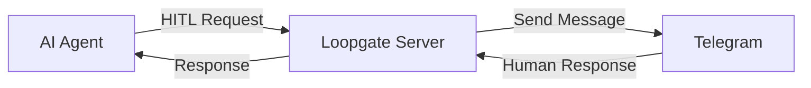

# 🔄 Loopgate

> **The Model Context Protocol (MCP) server that empowers AI agents with human oversight**

Loopgate is a high-performance, Golang-based MCP server that bridges AI agents and human operators for seamless Human-in-the-Loop (HITL) workflows. With real-time communication via Telegram, Loopgate ensures AI systems stay intelligent, compliant, and human-approved.


## 📋 Table of Contents

- [🎯 Why Loopgate?](#-why-loopgate)
- [⚡ Quick Start](#-quick-start)
- [🌟 Key Features](#-key-features)
- [💡 Use Cases](#-use-cases)
- [🛠️ Architecture](#️-architecture)
- [📡 API Reference](#-api-reference)
- [🔧 Configuration](#-configuration)
- [📚 Client SDKs](#-client-sdks)
- [🧪 Integration Examples](#-integration-examples)
- [🚀 Production Deployment](#-production-deployment)
- [📊 Monitoring and Observability](#-monitoring-and-observability)
- [🔒 Security Considerations](#-security-considerations)
- [🧪 Testing](#-testing)
- [🤝 Contributing](#-contributing)
- [📚 Documentation](#-documentation)
- [📄 License](#-license)
- [🆘 Support](#-support)

## 🎯 Why Loopgate?

In a world driven by automation, human wisdom remains essential. Loopgate enables AI agents to pause for human input, ensuring confidence in high-stakes decisions, compliance, or complex workflows.



## ⚡ Quick Start

### 1. Setup

```bash
# Clone the repository
git clone https://github.com/iris-networks/loopgate
cd loopgate

# Build the server
make build

# Set environment variables
export TELEGRAM_BOT_TOKEN="7123456789:AAEhBOweik6ad6PsWZRcXUgPaGFhqOClv"
export SERVER_PORT=8080

# Run the server
make run
```

### 2. Register Your AI Agent Session

```bash
curl -X POST http://localhost:8080/hitl/register \
  -H "Content-Type: application/json" \
  -d '{
    "session_id": "production-deploy-bot",
    "client_id": "ci-cd-pipeline", 
    "telegram_id": 123456789
  }'
```

### 3. Send HITL Request from Your AI Agent

```python
import requests
import time

# 1. Submit request  
response = requests.post('http://localhost:8080/hitl/request', json={
    "session_id": "production-deploy-bot",
    "client_id": "ci-cd-pipeline",
    "message": "Deploy v2.1.0 to production? All tests passed ✅",
    "options": ["🚀 Deploy", "⏸️ Hold", "🔍 Review First"],
    "metadata": {
        "version": "v2.1.0",
        "tests_passed": 847,
        "code_coverage": "94.2%",
        "environment": "production"
    }
})

result = response.json()
request_id = result["request_id"]
print(f"✅ Request submitted: {request_id}")

# 2. Poll for human response
while True:
    poll_response = requests.get(f'http://localhost:8080/hitl/poll?request_id={request_id}')
    status = poll_response.json()
    
    if status["status"] == "completed":
        if status["approved"]:
            print("🎉 Deployment approved! Proceeding...")
            # Execute deployment
        else:
            print(f"🛑 Deployment denied: {status['response']}")
        break
    
    print("⏳ Waiting for human response...")
    time.sleep(5)
```

## 🌟 Key Features

| Feature | Description |
|---------|-------------|
| **🤖 Multi-Agent Support** | Handle requests from multiple AI agents simultaneously |
| **📱 Telegram Integration** | Real-time communication through Telegram Bot API |
| **🔄 MCP Protocol** | Full Model Context Protocol 2.0 implementation |
| **⚡ Async by Default** | Non-blocking requests with polling and webhooks |
| **📊 Session Management** | Persistent session tracking and routing |
| **🔧 Flexible APIs** | HTTP REST + MCP protocol support |

## 💡 Use Cases

### 🚀 Production Deployments
```python
# AI requests approval before deploying to production
response = requests.post('http://localhost:8080/hitl/request', json={
    "session_id": "deploy-agent",
    "client_id": "ci-cd-pipeline",
    "message": "Deploy new ML model to production?",
    "options": ["Deploy", "Cancel", "Deploy to Staging First"],
    "metadata": {"model": "recommendation-v2.1", "accuracy": "94.2%"}
})
```

### 💰 Financial Trading
```javascript
// Trading bot requests approval for large orders
const response = await fetch('http://localhost:8080/hitl/request', {
    method: 'POST',
    headers: {'Content-Type': 'application/json'},
    body: JSON.stringify({
        session_id: "trading-bot",
        client_id: "algo-trader",
        message: "Execute large trade: Buy 10,000 AAPL at $150.25",
        options: ['Execute', 'Cancel', 'Reduce Size'],
        metadata: { symbol: 'AAPL', value: '$1,502,500', risk_score: 'Medium' }
    })
});
```

### 🏥 Healthcare AI
```go
// Medical AI requests doctor approval using MCP client
client := client.NewMCPClient()
client.ConnectToServer("./loopgate")
client.Initialize("MedicalAI", "1.0.0")

response, err := client.SendHITLRequest(
    "medical-session",
    "diagnostic-ai",
    "Recommend immediate surgery for patient #1234?",
    []string{"Approve", "Reject", "Request Second Opinion"},
    map[string]interface{}{
        "patient_id": "1234",
        "condition": "appendicitis", 
        "confidence": "89%",
    },
)
```

### 🤖 Content Moderation
```python
# Content AI escalates edge cases to human moderators
response = requests.post('http://localhost:8080/hitl/request', json={
    "session_id": "content-mod",
    "client_id": "moderation-ai",
    "message": "Flag this content as inappropriate?",
    "options": ["Flag", "Approve", "Needs Review"],
    "metadata": {"content_type": "image", "ai_confidence": 0.75}
})
```

## 🛠️ Architecture

Loopgate implements a robust, event-driven architecture:

```
┌─────────────┐    ┌─────────────┐    ┌─────────────┐
│ AI Agent A  │    │ AI Agent B  │    │ AI Agent C  │
└──────┬──────┘    └──────┬──────┘    └──────┬──────┘
       │                  │                  │
       │ MCP Protocol     │ HTTP API         │ WebSocket
       │                  │                  │
       └──────────────────┼──────────────────┘
                          │
                    ┌─────▼─────┐
                    │ Loopgate  │
                    │  Server   │
                    └─────┬─────┘
                          │
                    ┌─────▼─────┐
                    │ Telegram  │
                    │   Bot     │
                    └─────┬─────┘
                          │
          ┌───────────────┼───────────────┐
          │               │               │
    ┌─────▼─────┐  ┌─────▼─────┐  ┌─────▼─────┐
    │ Human A   │  │ Human B   │  │ Human C   │
    │ Operator  │  │ Operator  │  │ Operator  │
    └───────────┘  └───────────┘  └───────────┘
```

## 📡 API Reference

### MCP Protocol Tools

Loopgate exposes MCP tools for seamless AI agent integration:

#### `request_human_input`
Send human-in-the-loop requests via MCP protocol.

```json
{
  "name": "request_human_input",
  "arguments": {
    "session_id": "my-agent-session",
    "client_id": "my-ai-agent",
    "message": "Should I proceed with this action?",
    "options": ["Yes", "No", "Maybe"],
    "metadata": {"key": "value"}
  }
}
```

#### `check_request_status`
Check the status of a pending request.

```json
{
  "name": "check_request_status",
  "arguments": {
    "request_id": "550e8400-e29b-41d4-a716-446655440000"
  }
}
```

#### `list_pending_requests`
List all pending HITL requests.

```json
{
  "name": "list_pending_requests",
  "arguments": {}
}
```

#### `cancel_request`
Cancel a pending request.

```json
{
  "name": "cancel_request",
  "arguments": {
    "request_id": "550e8400-e29b-41d4-a716-446655440000"
  }
}
```

### HTTP Endpoints

| Endpoint | Method | Description |
|----------|--------|-------------|
| `/hitl/request` | POST | Submit HITL request (returns immediately) |
| `/hitl/poll` | GET | Poll for request status and response |
| `/hitl/register` | POST | Register AI agent session |
| `/hitl/status` | GET | Check session status |
| `/hitl/deactivate` | POST | Deactivate session |
| `/hitl/pending` | GET | List pending requests |
| `/hitl/cancel` | POST | Cancel pending request |
| `/health` | GET | Server health check |
| `/mcp` | POST | MCP protocol endpoint |
| `/mcp/tools` | GET | List available MCP tools |
| `/mcp/capabilities` | GET | Get MCP server capabilities |

## 🔧 Configuration

### Environment Variables

```bash
# Required
TELEGRAM_BOT_TOKEN=your_telegram_bot_token

# Optional  
SERVER_PORT=8080                 # Default: 8080
LOG_LEVEL=info                   # Default: info
REQUEST_TIMEOUT=300              # Default: 300 seconds
MAX_CONCURRENT_REQUESTS=100      # Default: 100
```

### Docker Support

```bash
# Build Docker image
make docker-build

# Run with Docker
docker run -e TELEGRAM_BOT_TOKEN=your_token loopgate:latest
```

## 📚 Client SDKs

### Go MCP Client
```go
import "loopgate/pkg/client"

client := client.NewMCPClient()
client.ConnectToServer("./loopgate")
client.Initialize("MyAI", "1.0.0")

response, err := client.SendHITLRequest(
    "session-1",
    "my-ai",
    "Approve this action?",
    []string{"Yes", "No"},
    map[string]interface{}{"context": "deployment"},
)
```

### Python HTTP Client
```python
import requests
import time

class LoopgateClient:
    def __init__(self, base_url="http://localhost:8080"):
        self.base_url = base_url
    
    def register_session(self, session_id, client_id, telegram_id):
        response = requests.post(f"{self.base_url}/hitl/register", json={
            "session_id": session_id,
            "client_id": client_id,
            "telegram_id": telegram_id
        })
        return response.json()
    
    def request_approval(self, session_id, client_id, message, options=None, metadata=None):
        data = {
            "session_id": session_id,
            "client_id": client_id,
            "message": message
        }
        if options:
            data["options"] = options
        if metadata:
            data["metadata"] = metadata
            
        response = requests.post(f"{self.base_url}/hitl/request", json=data)
        result = response.json()
        request_id = result["request_id"]
        
        # Poll for response
        while True:
            poll_resp = requests.get(f"{self.base_url}/hitl/poll?request_id={request_id}")
            status = poll_resp.json()
            
            if status["completed"]:
                return status
            
            time.sleep(2)

# Usage
client = LoopgateClient()
client.register_session("my-session", "my-ai", 123456789)
result = client.request_approval("my-session", "my-ai", "Approve deployment?", ["Yes", "No"])
```

### Node.js Client
```javascript
const axios = require('axios');

class LoopgateClient {
    constructor(baseURL = 'http://localhost:8080') {
        this.baseURL = baseURL;
    }
    
    async registerSession(sessionId, clientId, telegramId) {
        const response = await axios.post(`${this.baseURL}/hitl/register`, {
            session_id: sessionId,
            client_id: clientId,
            telegram_id: telegramId
        });
        return response.data;
    }
    
    async requestApproval(sessionId, clientId, message, options = null, metadata = null) {
        const data = { session_id: sessionId, client_id: clientId, message };
        if (options) data.options = options;
        if (metadata) data.metadata = metadata;
        
        const response = await axios.post(`${this.baseURL}/hitl/request`, data);
        const requestId = response.data.request_id;
        
        // Poll for response
        while (true) {
            const pollResp = await axios.get(`${this.baseURL}/hitl/poll?request_id=${requestId}`);
            const status = pollResp.data;
            
            if (status.completed) {
                return status;
            }
            
            await new Promise(resolve => setTimeout(resolve, 2000));
        }
    }
}

// Usage
const client = new LoopgateClient();
await client.registerSession('my-session', 'my-ai', 123456789);
const result = await client.requestApproval('my-session', 'my-ai', 'Approve deployment?', ['Yes', 'No']);
```

## 🧪 Integration Examples

### Claude with MCP
```typescript
// Claude's Model Context Protocol integration
import { MCPServer } from '@modelcontextprotocol/sdk/server';

const server = new MCPServer({
  name: "loopgate-integration",
  version: "1.0.0"
});

server.addTool({
  name: "request_human_approval",
  description: "Request human approval for actions",
  parameters: {
    message: { type: "string" },
    options: { type: "array" }
  },
  handler: async (params) => {
    // Connect to Loopgate MCP server
    const response = await fetch('http://localhost:8080/mcp', {
      method: 'POST',
      body: JSON.stringify({
        method: "tools/call",
        params: {
          name: "request_human_input",
          arguments: params
        }
      })
    });
    return await response.json();
  }
});
```

### OpenAI Function Calling
```python
import openai
import requests

def request_human_approval(message: str, options: list = None, metadata: dict = None) -> dict:
    """Request human approval via Loopgate"""
    response = requests.post('http://localhost:8080/hitl/request', json={
        "session_id": "openai-session",
        "client_id": "openai-agent", 
        "message": message,
        "options": options or [],
        "metadata": metadata or {}
    })
    
    request_id = response.json()["request_id"]
    
    # Poll for response
    while True:
        poll_resp = requests.get(f'http://localhost:8080/hitl/poll?request_id={request_id}')
        status = poll_resp.json()
        if status["completed"]:
            return status
        time.sleep(2)

# Register as OpenAI function
functions = [{
    "name": "request_human_approval",
    "description": "Request human approval for sensitive actions",
    "parameters": {
        "type": "object",
        "properties": {
            "message": {"type": "string"},
            "options": {"type": "array", "items": {"type": "string"}},
            "metadata": {"type": "object"}
        },
        "required": ["message"]
    }
}]

client = openai.OpenAI()
response = client.chat.completions.create(
    model="gpt-4",
    messages=[{"role": "user", "content": "Deploy the new version"}],
    functions=functions,
    function_call="auto"
)
```

### Anthropic Claude Integration
```python
import anthropic
import json

def claude_with_loopgate():
    client = anthropic.Anthropic()
    
    system_prompt = """
    You are an AI assistant with access to human oversight through the request_human_approval function.
    Use this function for any high-stakes decisions, sensitive operations, or when you're uncertain.
    """
    
    tools = [{
        "name": "request_human_approval",
        "description": "Request human approval for important decisions",
        "input_schema": {
            "type": "object",
            "properties": {
                "message": {"type": "string"},
                "options": {"type": "array", "items": {"type": "string"}},
                "reasoning": {"type": "string"}
            },
            "required": ["message", "reasoning"]
        }
    }]
    
    message = client.messages.create(
        model="claude-3-sonnet-20240229",
        max_tokens=1000,
        system=system_prompt,
        tools=tools,
        messages=[
            {"role": "user", "content": "I need to delete all production data older than 1 year"}
        ]
    )
    
    # Claude will automatically call request_human_approval for this sensitive operation
    return message
```

### Vercel AI SDK Integration
```typescript
import { tool } from 'ai';
import { z } from 'zod';

// Register the human approval tool
export const requestHumanApproval = tool({
  description: 'Request human approval for sensitive actions via Telegram',
  parameters: z.object({
    message: z.string().describe('The approval request message'),
    options: z.array(z.string()).optional().describe('Response options for the human'),
    session_id: z.string().optional().describe('Session identifier'),
    client_id: z.string().optional().describe('Client identifier'),
    metadata: z.record(z.any()).optional().describe('Additional context')
  }),
  execute: async ({ message, options = [], session_id = 'vercel-ai-session', client_id = 'vercel-ai-agent', metadata = {} }) => {
    // 1. Register session (if not already done)
    await fetch('http://localhost:8080/sessions/register', {
      method: 'POST',
      headers: { 'Content-Type': 'application/json' },
      body: JSON.stringify({
        session_id,
        client_id,
        telegram_id: 123456789 // Your Telegram ID
      })
    });

    // 2. Submit HITL request
    const response = await fetch('http://localhost:8080/hitl/request', {
      method: 'POST',
      headers: { 'Content-Type': 'application/json' },
      body: JSON.stringify({
        session_id,
        client_id,
        message,
        options,
        metadata
      })
    });

    const { request_id } = await response.json();

    // 3. Poll for human response
    while (true) {
      const pollResp = await fetch(`http://localhost:8080/hitl/poll?request_id=${request_id}`);
      const status = await pollResp.json();
      
      if (status.completed) {
        return {
          approved: status.response,
          metadata: status.metadata,
          timestamp: status.timestamp
        };
      }
      
      await new Promise(resolve => setTimeout(resolve, 2000));
    }
  }
});

// Usage in your Vercel AI SDK app
import { generateObject } from 'ai';
import { openai } from '@ai-sdk/openai';

const result = await generateObject({
  model: openai('gpt-4'),
  tools: { requestHumanApproval },
  prompt: 'Deploy the new version to production',
  toolChoice: 'auto'
});
```

## 🚀 Production Deployment

### Prerequisites
- Go 1.21+
- Telegram Bot Token (create via @BotFather)
- Server with public internet access

### Deployment Options

#### Traditional Server
```bash
# Build for production
make build

# Create systemd service
sudo tee /etc/systemd/system/loopgate.service > /dev/null <<EOF
[Unit]
Description=Loopgate MCP Server
After=network.target

[Service]
Type=simple
User=loopgate
WorkingDirectory=/opt/loopgate
ExecStart=/opt/loopgate/loopgate
Environment=TELEGRAM_BOT_TOKEN=your_token_here
Environment=SERVER_PORT=8080
Restart=always
RestartSec=5

[Install]
WantedBy=multi-user.target
EOF

# Enable and start
sudo systemctl enable loopgate
sudo systemctl start loopgate
```

#### Docker Compose
```yaml
version: '3.8'
services:
  loopgate:
    build: .
    ports:
      - "8080:8080"
    environment:
      - TELEGRAM_BOT_TOKEN=${TELEGRAM_BOT_TOKEN}
      - LOG_LEVEL=info
    restart: unless-stopped
    healthcheck:
      test: ["CMD", "curl", "-f", "http://localhost:8080/health"]
      interval: 30s
      timeout: 10s
      retries: 3
```

#### Kubernetes
```yaml
apiVersion: apps/v1
kind: Deployment
metadata:
  name: loopgate
  labels:
    app: loopgate
spec:
  replicas: 2
  selector:
    matchLabels:
      app: loopgate
  template:
    metadata:
      labels:
        app: loopgate
    spec:
      containers:
      - name: loopgate
        image: loopgate:latest
        ports:
        - containerPort: 8080
        env:
        - name: TELEGRAM_BOT_TOKEN
          valueFrom:
            secretKeyRef:
              name: loopgate-secret
              key: telegram-token
        livenessProbe:
          httpGet:
            path: /health
            port: 8080
          initialDelaySeconds: 30
          periodSeconds: 10
        readinessProbe:
          httpGet:
            path: /health
            port: 8080
          initialDelaySeconds: 5
          periodSeconds: 5
---
apiVersion: v1
kind: Service
metadata:
  name: loopgate-service
spec:
  selector:
    app: loopgate
  ports:
  - protocol: TCP
    port: 80
    targetPort: 8080
  type: LoadBalancer
```

## 📊 Monitoring and Observability

### Health Checks
```bash
# Basic health check
curl http://localhost:8080/health

# Detailed session status
curl "http://localhost:8080/hitl/status?session_id=my-session"

# List pending requests
curl http://localhost:8080/hitl/pending
```

### Logging
Loopgate provides structured logging for monitoring:

```json
{
  "timestamp": "2024-01-15T10:30:00Z",
  "level": "info",
  "message": "HITL request submitted",
  "request_id": "550e8400-e29b-41d4-a716-446655440000",
  "client_id": "production-bot",
  "session_id": "deploy-session"
}
```

### Metrics Integration
Future versions will include Prometheus metrics:

```
# HELP loopgate_hitl_requests_total Total HITL requests
# TYPE loopgate_hitl_requests_total counter
loopgate_hitl_requests_total{client_id="production-bot"} 1234

# HELP loopgate_active_sessions Current active sessions  
# TYPE loopgate_active_sessions gauge
loopgate_active_sessions 5

# HELP loopgate_response_time_seconds HITL response time
# TYPE loopgate_response_time_seconds histogram
```

## 🔒 Security Considerations

### Authentication
- Telegram bot tokens should be kept secure
- Consider implementing API key authentication for HTTP endpoints
- Use HTTPS in production environments

### Network Security
```bash
# Firewall configuration (Ubuntu/Debian)
sudo ufw allow 22    # SSH
sudo ufw allow 8080  # Loopgate
sudo ufw enable
```

### Environment Variables
```bash
# Use secrets management in production
export TELEGRAM_BOT_TOKEN=$(vault kv get -field=token secret/loopgate)
```

## 🧪 Testing

### Unit Tests
```bash
# Run all tests
make test

# Run tests with coverage
make test-coverage

# Run specific test
go test -v ./internal/session
```

### Integration Testing
```bash
# Start test environment
docker-compose -f docker-compose.test.yml up -d

# Run integration tests
go test -v -tags=integration ./tests/...
```

### Manual Testing
```bash
# 1. Start server
make run

# 2. Register session
curl -X POST http://localhost:8080/hitl/register \
  -H "Content-Type: application/json" \
  -d '{"session_id": "test", "client_id": "test", "telegram_id": 123456789}'

# 3. Submit request
curl -X POST http://localhost:8080/hitl/request \
  -H "Content-Type: application/json" \
  -d '{"session_id": "test", "client_id": "test", "message": "Test message"}'
```

## 🤝 Contributing

We welcome contributions! Please see our [Contributing Guide](CONTRIBUTING.md) for details.

### Development Setup
```bash
git clone https://github.com/your-username/loopgate.git
cd loopgate
make deps
make test
make run
```

### Code Style
- Follow Go conventions
- Use `gofmt` for formatting  
- Add tests for new features
- Update documentation

### Submitting Changes
1. Fork the repository
2. Create a feature branch
3. Make your changes
4. Add tests
5. Submit a pull request

## 📚 Documentation

- [MCP Integration Guide](docs/MCP_INTEGRATION.md)
- [Usage Examples](docs/USAGE.md)
- [API Reference](docs/API.md)
- [Deployment Guide](docs/DEPLOYMENT.md)

## 📄 License

This project is licensed under the MIT License - see the [LICENSE](LICENSE) file for details.

## 🆘 Support

- 📖 [Documentation](docs/)
- 🐛 [Issue Tracker](https://github.com/your-username/loopgate/issues)
- 💬 [Discussions](https://github.com/your-username/loopgate/discussions)
- 📧 Email: support@loopgate.io

## 🌟 Star History

[](https://star-history.com/#your-username/loopgate&Date)

---

**Loopgate: Where AI meets human wisdom for smarter, safer automation.**

*Made with ❤️ by the Loopgate team*