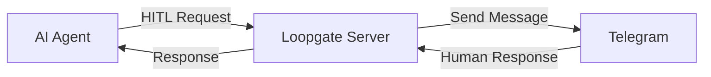

# 🔄 Loopgate

> **The Model Context Protocol (MCP) server that empowers AI agents with human oversight**

Loopgate is a high-performance, Golang-based MCP server that bridges AI agents and human operators for seamless Human-in-the-Loop (HITL) workflows. With real-time communication via Telegram, Loopgate ensures AI systems stay intelligent, compliant, and human-approved.


## 🎯 Why Loopgate?

In a world driven by automation, human wisdom remains essential. Loopgate enables AI agents to pause for human input, ensuring confidence in high-stakes decisions, compliance, or complex workflows.



## ⚡ Quick Start

### 1. Setup

```bash
# Clone the repository
git clone https://github.com/your-username/loopgate.git
cd loopgate

# Build the server
make build

# Set environment variables
export TELEGRAM_BOT_TOKEN="7123456789:AAEhBOweik6ad6PsWZRcXUgPaGFhqOClv"
export SERVER_PORT=8080

# Run the server
make run
```

### 2. Register Your AI Agent Session

```bash
curl -X POST http://localhost:8080/hitl/register \
  -H "Content-Type: application/json" \
  -d '{
    "session_id": "production-deploy-bot",
    "client_id": "ci-cd-pipeline", 
    "telegram_id": 123456789
  }'
```

### 3. Send HITL Request from Your AI Agent

```python
import requests

# Your AI agent requests human approval
response = requests.post('http://localhost:8080/hitl/request', json={
    "session_id": "production-deploy-bot",
    "client_id": "ci-cd-pipeline",
    "message": "Deploy v2.1.0 to production? All tests passed ✅",
    "options": ["🚀 Deploy", "⏸️ Hold", "🔍 Review First"],
    "metadata": {
        "version": "v2.1.0",
        "tests_passed": 847,
        "code_coverage": "94.2%",
        "environment": "production"
    }
})

result = response.json()
if result["approved"]:
    print("🎉 Deployment approved! Proceeding...")
    # Execute deployment
else:
    print(f"🛑 Deployment denied: {result['response']}")
```

## 🌟 Key Features

| Feature | Description |
|---------|-------------|
| **🤖 Multi-Agent Support** | Handle requests from multiple AI agents simultaneously |
| **📱 Telegram Integration** | Real-time communication through Telegram Bot API |
| **🔄 MCP Protocol** | Full Model Context Protocol 2.0 implementation |
| **⚡ High Performance** | Built with Go for speed and concurrency |
| **📊 Session Management** | Persistent session tracking and routing |
| **🔧 Flexible APIs** | HTTP REST + MCP protocol support |

## 💡 Use Cases

### 🚀 Production Deployments
```python
# AI requests approval before deploying to production
await loopgate.request_approval(
    "Deploy new ML model to production?",
    options=["Deploy", "Cancel", "Deploy to Staging First"],
    metadata={"model": "recommendation-v2.1", "accuracy": "94.2%"}
)
```

### 💰 Financial Trading
```javascript
// Trading bot requests approval for large orders
const approval = await loopgate.requestApproval(
    `Execute large trade: Buy 10,000 AAPL at $150.25`,
    ['Execute', 'Cancel', 'Reduce Size'],
    { symbol: 'AAPL', value: '$1,502,500', risk_score: 'Medium' }
);
```

### 🏥 Healthcare AI
```go
// Medical AI requests doctor approval
response, err := client.SendHITLRequest(ctx, HITLRequest{
    Message: "Recommend immediate surgery for patient #1234?",
    Options: []string{"Approve", "Reject", "Request Second Opinion"},
    Metadata: map[string]interface{}{
        "patient_id": "1234",
        "condition": "appendicitis", 
        "confidence": "89%",
    },
})
```

### 🤖 Content Moderation
```python
# Content AI escalates edge cases to human moderators
await loopgate.request_approval(
    "Flag this content as inappropriate?",
    options=["Flag", "Approve", "Needs Review"],
    metadata={"content_type": "image", "ai_confidence": 0.75}
)
```

## 🛠️ Architecture

Loopgate implements a robust, event-driven architecture:

```
┌─────────────┐    ┌─────────────┐    ┌─────────────┐
│ AI Agent A  │    │ AI Agent B  │    │ AI Agent C  │
└──────┬──────┘    └──────┬──────┘    └──────┬──────┘
       │                  │                  │
       │ MCP Protocol     │ HTTP API         │ WebSocket
       │                  │                  │
       └──────────────────┼──────────────────┘
                          │
                    ┌─────▼─────┐
                    │ Loopgate  │
                    │  Server   │
                    └─────┬─────┘
                          │
                    ┌─────▼─────┐
                    │ Telegram  │
                    │   Bot     │
                    └─────┬─────┘
                          │
          ┌───────────────┼───────────────┐
          │               │               │
    ┌─────▼─────┐  ┌─────▼─────┐  ┌─────▼─────┐
    │ Human A   │  │ Human B   │  │ Human C   │
    │ Operator  │  │ Operator  │  │ Operator  │
    └───────────┘  └───────────┘  └───────────┘
```

## 📡 API Reference

### MCP Protocol Tools

Loopgate exposes MCP tools for seamless AI agent integration:

#### `hitl_request`
Send human-in-the-loop requests via MCP protocol.

```json
{
  "name": "hitl_request",
  "arguments": {
    "session_id": "my-agent-session",
    "client_id": "my-ai-agent",
    "message": "Should I proceed with this action?",
    "options": ["Yes", "No", "Maybe"],
    "metadata": {"key": "value"}
  }
}
```

### HTTP Endpoints

| Endpoint | Method | Description |
|----------|--------|-------------|
| `/hitl/register` | POST | Register AI agent session |
| `/hitl/request` | POST | Send HITL request |
| `/hitl/status` | GET | Check session status |
| `/hitl/deactivate` | POST | Deactivate session |
| `/health` | GET | Server health check |
| `/mcp` | POST | MCP protocol endpoint |

## 🔧 Configuration

### Environment Variables

```bash
# Required
TELEGRAM_BOT_TOKEN=your_telegram_bot_token

# Optional  
SERVER_PORT=8080                 # Default: 8080
LOG_LEVEL=info                   # Default: info
```

### Docker Support

```bash
# Build Docker image
make docker-build

# Run with Docker
docker run -e TELEGRAM_BOT_TOKEN=your_token loopgate:latest
```

## 📚 Client SDKs

### Go SDK
```go
import "loopgate/pkg/client"

client := client.NewMCPClient()
client.ConnectToServer("./loopgate")
client.Initialize("MyAI", "1.0.0")

response, err := client.SendHITLRequest(ctx, HITLRequest{
    SessionID: "session-1",
    ClientID:  "my-ai",
    Message:   "Approve this action?",
})
```

### Python SDK
```python
import requests

class LoopgateClient:
    def __init__(self, base_url="http://localhost:8080"):
        self.base_url = base_url
    
    def request_approval(self, session_id, message, options=None):
        # Implementation details...
```

### Node.js SDK
```javascript
const { LoopgateClient } = require('loopgate-client');

const client = new LoopgateClient('http://localhost:8080');
const response = await client.requestApproval(sessionId, message, options);
```

## 🧪 Example Integrations

### Claude with MCP
```typescript
// Claude's Model Context Protocol integration
const server = new MCPServer({
  name: "loopgate-integration",
  version: "1.0.0"
});

server.addTool({
  name: "request_human_approval",
  description: "Request human approval for actions",
  parameters: {
    message: { type: "string" },
    options: { type: "array" }
  },
  handler: async (params) => {
    return await loopgate.requestApproval(params.message, params.options);
  }
});
```

### OpenAI Function Calling
```python
import openai

def request_human_approval(message: str, options: list) -> dict:
    """Request human approval via Loopgate"""
    # Call Loopgate API
    return loopgate_client.request_approval(message, options)

# Register as OpenAI function
functions = [{
    "name": "request_human_approval",
    "description": "Request human approval for sensitive actions",
    "parameters": {
        "type": "object",
        "properties": {
            "message": {"type": "string"},
            "options": {"type": "array"}
        }
    }
}]
```

## 🚀 Production Deployment

### Prerequisites
- Go 1.21+
- Telegram Bot Token
- PostgreSQL (optional, for persistent storage)

### Deployment Options

#### Traditional Server
```bash
# Build for production
make build

# Run with systemd
sudo systemctl enable loopgate
sudo systemctl start loopgate
```

#### Docker
```dockerfile
FROM golang:1.21-alpine AS builder
WORKDIR /app
COPY . .
RUN go build -o loopgate cmd/server/main.go

FROM alpine:latest
RUN apk --no-cache add ca-certificates
COPY --from=builder /app/loopgate .
CMD ["./loopgate"]
```

#### Kubernetes
```yaml
apiVersion: apps/v1
kind: Deployment
metadata:
  name: loopgate
spec:
  replicas: 3
  selector:
    matchLabels:
      app: loopgate
  template:
    metadata:
      labels:
        app: loopgate
    spec:
      containers:
      - name: loopgate
        image: loopgate:latest
        env:
        - name: TELEGRAM_BOT_TOKEN
          valueFrom:
            secretKeyRef:
              name: loopgate-secret
              key: token
```

## 📊 Monitoring

### Metrics
Loopgate exposes Prometheus metrics at `/metrics`:

```
# HELP loopgate_hitl_requests_total Total HITL requests
# TYPE loopgate_hitl_requests_total counter
loopgate_hitl_requests_total{client_id="production-bot"} 1234

# HELP loopgate_active_sessions Current active sessions  
# TYPE loopgate_active_sessions gauge
loopgate_active_sessions 5

# HELP loopgate_response_time_seconds HITL response time
# TYPE loopgate_response_time_seconds histogram
```

### Health Checks
```bash
# Basic health check
curl http://localhost:8080/health

# Detailed status
curl http://localhost:8080/hitl/status?session_id=my-session
```

## 🤝 Contributing

We welcome contributions! Please see our [Contributing Guide](CONTRIBUTING.md) for details.

### Development Setup
```bash
git clone https://github.com/your-username/loopgate.git
cd loopgate
make deps
make test
make run
```

### Running Tests
```bash
make test          # Run all tests
make test-coverage # Run tests with coverage
make lint          # Run linter
```

## 📄 License

This project is licensed under the MIT License - see the [LICENSE](LICENSE) file for details.

## 🆘 Support

- 📖 [Documentation](docs/USAGE.md)
- 🐛 [Issue Tracker](https://github.com/your-username/loopgate/issues)
- 💬 [Discussions](https://github.com/your-username/loopgate/discussions)
- 📧 Email: support@loopgate.io

## 🌟 Star History

[](https://star-history.com/#your-username/loopgate&Date)

---

**Loopgate: Where AI meets human wisdom for smarter, safer automation.**

*Made with ❤️ by the Loopgate team*